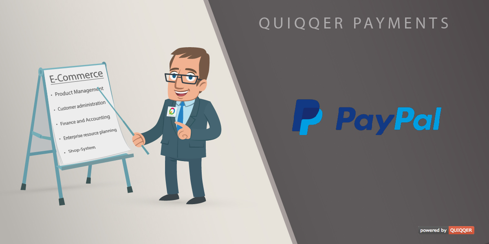

QUIQQER Payment with PayPal
========

The QUIQQER Payment with PayPal module offers your customers the option to pay orders with a PayPal account.

**IMPORTANT:** Requires a PayPal account for the merchant/seller
  * https://www.paypal.com/

Features
--------

* Offer your customers the option to pay with an PayPal account
* Customizable PayPal button
* Optional PayPal Express button for a fast checkout per basket or single product item
* **NEW**: Now features recurring payments with Billing Plans and Billing Agreements for subscription plan products

Installation
------------

Package name: quiqqer/payment-paypal

Follow the instructions here to configure this module:
https://dev.quiqqer.com/quiqqer/payment-paypal/wikis/api-configuration

Collaboration
----------

- Issue Tracker: https://dev.quiqqer.com/quiqqer/payment-paypal/issues
- Source Code: https://dev.quiqqer.com/quiqqer/payment-paypal

Support
-------

If you found any flaws, have any wishes or suggestions you can send an email to support@pcsg.de to inform us about your concerns. 
We will try to respond to your request and forward it to the responsible developer.

License
-------
PCSG QL-1.0, GPL-3.0+