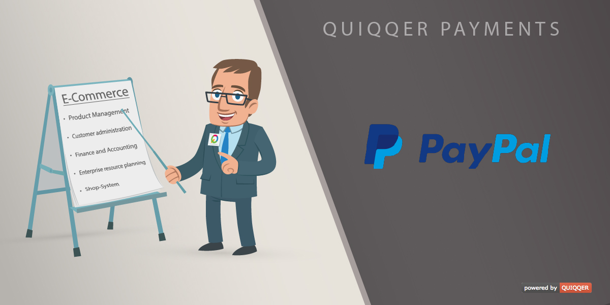

# QUIQQER Payment with PayPal

PayPal payment integration for QUIQQER ERP. The package supports one-time checkout, PayPal Express, and recurring
payments while payment credentials and approval remain on PayPal's infrastructure.

## Features

- One-time order payments through the PayPal Checkout Orders API
- PayPal Express checkout for baskets and mini baskets
- Optional transfer of detailed basket and shipping data
- Recurring payments through the PayPal Subscriptions API
- Verified webhook processing for subscription lifecycle and payment events
- Synchronization fallback when subscription webhooks are delayed or unavailable
- Continued support for existing legacy Billing Agreements

## Requirements

- PHP 8.2 or newer
- QUIQQER Core 2.25.1 or newer
- QUIQQER ERP 4.0.1 or newer
- `quiqqer/payments` 4.0.2 or newer
- An activated PayPal merchant account
- `quiqqer/erp-plans` when recurring plan products are used

## Installation

Install the package through Composer:

```shell
composer require quiqqer/payment-paypal
```

Run the QUIQQER setup afterwards so that database tables, settings, events, and cron jobs are imported.

## Configuration

Open **Settings → PayPal → API settings** in the QUIQQER administration and configure the client ID and secret for the
live environment. Separate credentials and a switch are available for the PayPal sandbox.

The payment settings control basket details and the available PayPal Express buttons. See the
[API configuration guide](https://dev.quiqqer.com/quiqqer/payment-paypal/-/wikis/api-configuration) for the PayPal
application setup.

For recurring payments, configure PayPal to call the subscription webhook endpoint provided by the package. Store the
webhook ID created by PayPal in **Settings → PayPal → API settings** so incoming signatures can be verified.

## Recurring payments

New recurring contracts use PayPal catalog products, billing plans, and subscriptions from the current Subscriptions
API. Subscription lifecycle and payment events are stored separately and can be assigned to QUIQQER invoices and
transactions.

Existing Billing Agreements remain on the legacy PayPal API path. They can continue to be billed, suspended, resumed,
or cancelled, but the package does not create new legacy agreements and does not migrate them automatically. A customer
must approve a new PayPal Subscription before an existing agreement can be replaced.

## Development

Initialize and run the package-local development tools:

```shell
composer dev:init
composer test
```

The quality checks run PHPStan level 8, PHPCS, and PHPUnit. Integration tests use the configured QUIQQER development
database and clean up their fixtures after every run.

## Support and collaboration

- [Issue tracker](https://dev.quiqqer.com/quiqqer/payment-paypal/-/issues)
- [Source code](https://dev.quiqqer.com/quiqqer/payment-paypal)
- [QUIQQER documentation](https://www.quiqqer.com/docs/)
- Email: support@pcsg.de

## License

GPL-3.0-or-later and PCSG QL-1.0. See [LICENSE](LICENSE).
